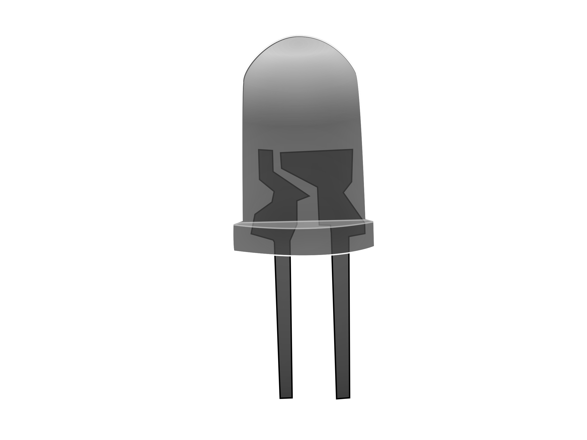

#### Synchronous Counter

Step-1) Press Switch to supply 5V to the circuit. 
        The switch in ON state is  and the switch in OFF state is  
Step-2) Press Counter button to start the counter. 
Step-3) Different combination of LEDs lit up for different combination of inputs. 
        The LED in OFF state is  and the LED in ON state is  . 
        The data is simultaneously added to the Truth Table. 
Step-4) Repeat Steps 2 to 3 for another set of data. 
Step-5) Click on "Generate Waveform" Button to generate the Timing Diagram .  
Step-6) Click "Print" to get the print out of the Truth Table and the Timing Diagram.   

#### Asynchronous Counter

Step-1) Press Switch to supply 5V to the circuit. 
        The switch in ON state is  and the switch in OFF state is  
Step-2) Press Counter button to start the counter. 
Step-3) Different combination of LEDs lit up for different combination of inputs. 
        The LED in OFF state is  and the LED in ON state is  . 
        The data is simultaneously added to the Truth Table.                  
Step-4) Repeat Steps 2 to 3 for another set of data. 
Step-5) Click on "Generate Waveform" Button to generate the Timing Diagram .  
Step-6) Click "Print" to get the print out of the Truth Table and the Timing Diagram.   </a>