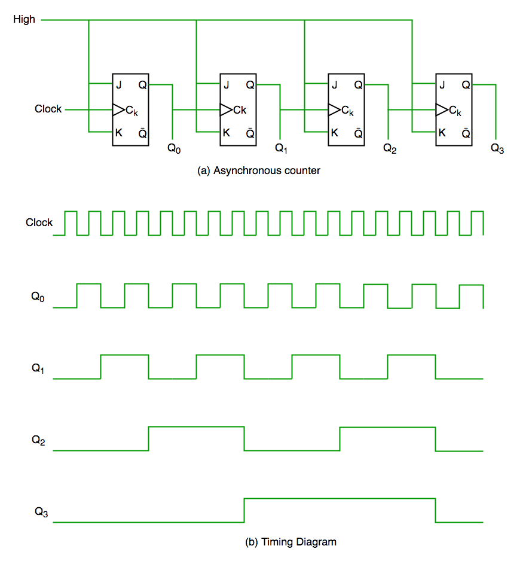
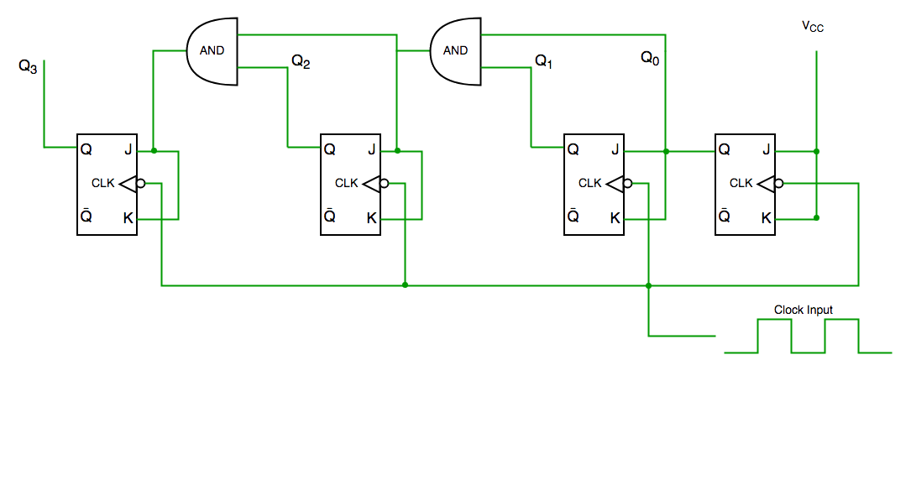
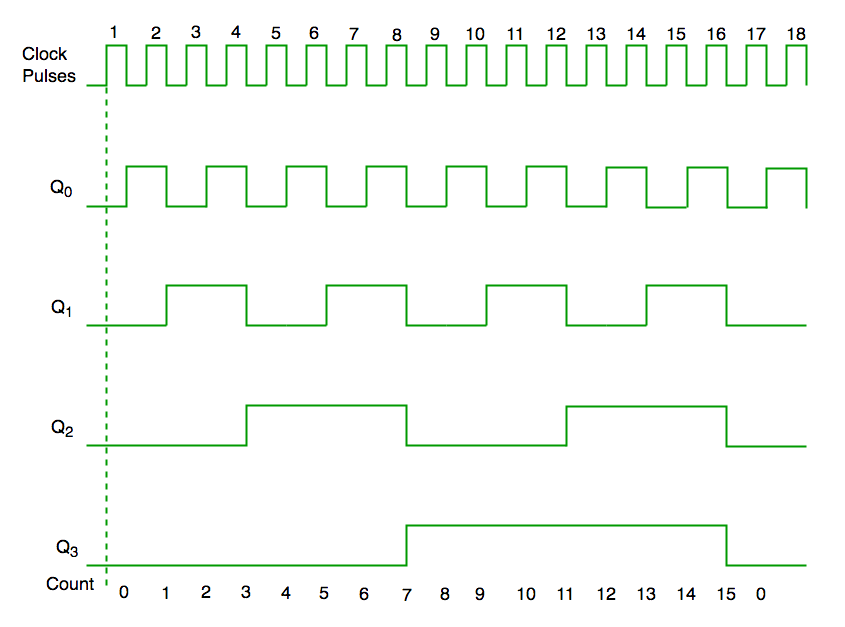

### Introduction

A counter is a device which stores (and sometimes displays) the number of times a particular event or process has occurred, often in relationship to a clock signal. Counters are used in digital electronics for counting purpose, they can count specific event happening in the circuit. For example, in UP counter a counter increases count for every rising edge of clock.

### Classification of Counters
Counters are broadly divided into two categories  
1. Asynchronous counter 
2. Synchronous counter 

### 1) Asynchronous Counter

In asynchronous counter we don’t use universal clock, only first flip flop is driven by main clock and the clock input of rest of the following counters is driven by output of previous flip flops. We can understand it by following diagram-  
							

    <b>Figure-1: Asynchronous Counter Circuit and Timing Diagram</b> 

      
It is evident from timing diagram that Q0 is changing as soon as the rising edge of clock pulse is encountered, Q1 is changing when rising edge of Q0 is encountered(because Q0 is like clock pulse for second flip flop) and so on. In this way ripples are generated through Q0,Q1,Q2,Q3 hence it is also called RIPPLE counter.   

### 2) Synchronous Counter 
  
Unlike the asynchronous counter, synchronous counter has one global clock which drives each flip flop so output changes in parallel. The one advantage of synchronous counter over asynchronous counter is, it can operate on higher frequency than asynchronous counter as it does not have cumulative delay because of same clock is given to each flip flop.  

 
  
   

<b>Figure-2: Synchronous Counter Circuit and Timing Diagram</b> 
 
      

From circuit diagram we see that Q0 bit gives response to each falling edge of clock while Q1 is dependent on Q0, Q2 is dependent on Q1 and Q0 , Q3 is dependent on Q2,Q1 and Q0.

